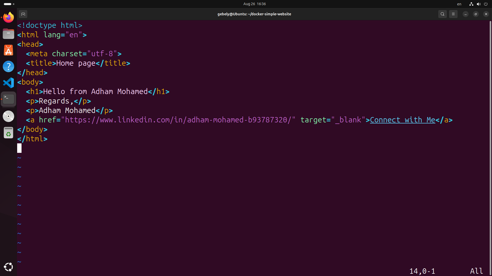
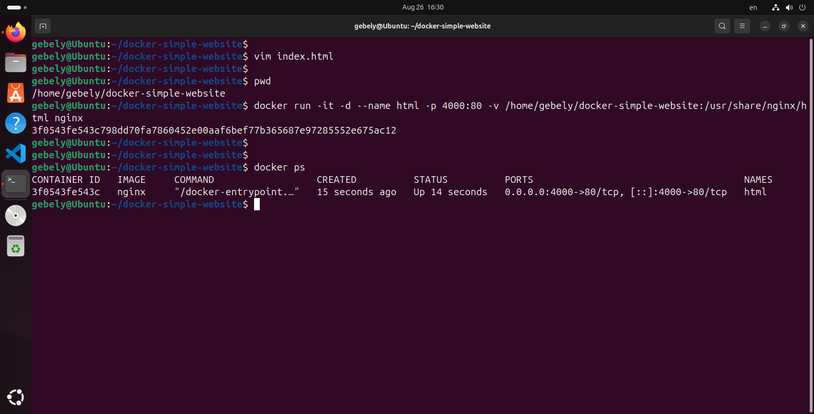
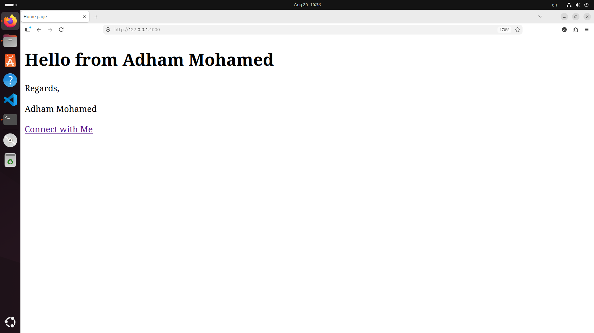

# 🐳 Docker Simple HTML Website
## 💡 Project Idea

This project demonstrates how to run a simple static HTML web page inside a Docker container using **Nginx** as a web server.

The HTML page displays a short welcome message and a link to a LinkedIn profile.

The project also demonstrates how to update the HTML content and see the changes instantly in the browser without rebuilding the Docker container.


## 📂 Project Structure

```text
docker-simple-website/
├── index.html
├── Screenshots/
│   ├── browser.png
│   ├── create-container.png
│   └── html-code.png
└── README.md
```

## 🚀 Run the Project

### 1. Clone the repository

```bash
git clone https://github.com/adhamgebely/docker-simple-html-website.git
```

### 2. Enter the project directory

```bash
cd docker-simple-html-website
```

### 3. Run the Docker container

```bash
docker run -it -d --name html -p 4000:80 -v $(pwd):/usr/share/nginx/html nginx
```

### 4. Open the website

Open your browser and visit:

```text
http://localhost:4000
```

## 🛑 Stop the Container

```bash
docker stop html
```

## ▶️ Start the Container Again

```bash
docker start html
```

## 🗑️ Remove the Container

```bash
docker rm -f html
```

## 📸 Screenshots

### HTML Code



### Docker Container



### Website



## 🎯 What I Learned

* Running Docker containers
* Serving HTML files using Nginx
* Port mapping with Docker
* Using Docker volume mounts
* Managing projects with Git and GitHub


## 👨‍💻 Author

**Adham Gebely**

[GitHub](https://github.com/adhamgebely)

---

⭐ Thanks for checking out the project!

